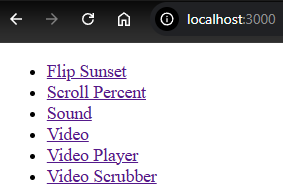
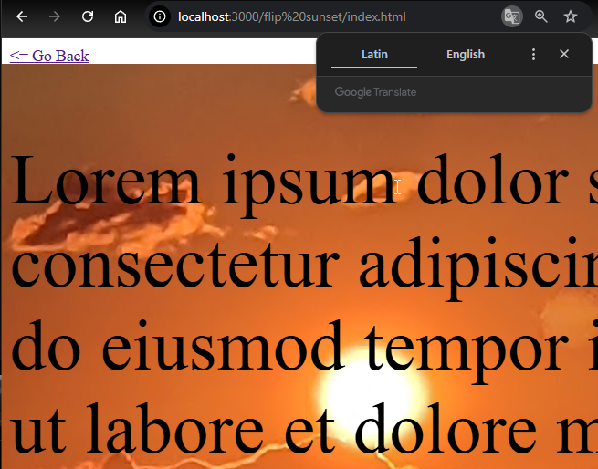
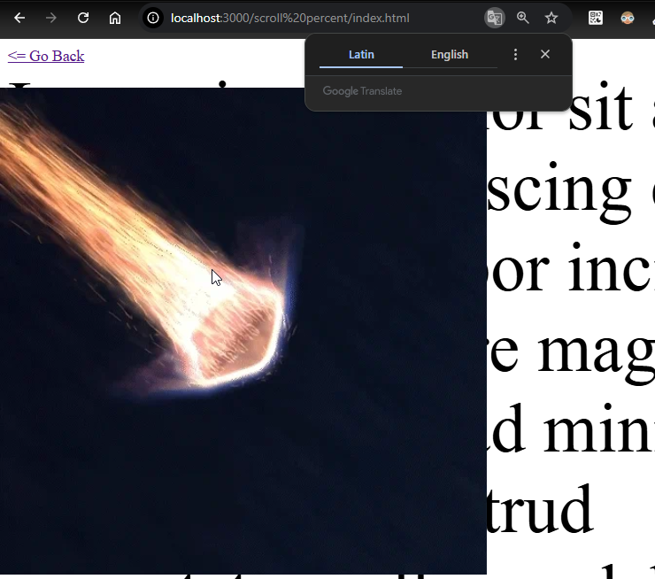
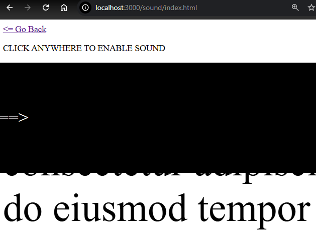

# Introduction

I created this project to explore different ways of working with sound, video, and vanilla CSS animations; especially with the "scroll culture" we currently have in social media in mind.

Perhaps someday I will use these techniques to create something interesting, but whether I do or not you are welcome to reuse any of the code or assets.

# LLM Contributions

If some of the JavaScript and CSS in this project looks a little _extra_, know that I did enlist the help of ChatGPT for much of this work.

# Running the project

- Clone the repo
- Navigate to the repo root
- Run the command `node server` in a terminal
- Access the primary index page via a browser at http://localhost:3000

> **NOTE**: if you would like to change the port, you can set `const port = [your desired port]` in server.js

# Viewing the Demos

To access the demos, complete the [running the project steps](#running-the-project) above. Once you've done that, you should see the main index in your browser:

From here, click on each link to view the corresponding demo. To return to the main page, use the "Go Back" link at the top of each demo's page.

# Demo descriptions

I'll share a screenshot of each demo and bit about what I was going for with each one. Note that this was a learning process for me from beginning to end, so the demos get progressively more ambititious.

## Flip Sunset

For this demo I was focused on getting my head around doing some kind of animation based on scrolling the page. The 'lorem ipsum' content a scrollable "body" against which the scrolling animation—in this case a flipping of the background image—is executed.

## Scroll Percent

The "Percent" title of this demo is a bit of a misnomer, because the demo shows movement of an image across the page based on how far the user has scrolled down the page. But it's pretty easy to imagine a progress bar filling up instead as the user scrolls of an image moving (in fact that was where I had started with this demo).

## Sound

I wanted to provide a different way of experiencing sound, and I think this demo definitely achieves that. Once you have clicked the page to enable sound playback, scroll one tick to hear a music clip (from ["Devil's Water" by Rennie Foster](https://youtu.be/M1u-RlVyBvA)). You'll notice that if you keep scrolling you will hear multiple overlapping instances of the audio playing back. This can get a bit overwhelming, but I think it works fairly well with this piece of music.

Oh, also notice that the music will play backwards if you scroll upwards on the page :)

## Video

[Video demo screenshot](assets/readme/video.png)
This is my first attempt at embedding a video player, which plays a small snippet of perhaps my favorite animation scenes of all time (thanks, [Arcane](https://www.imdb.com/title/tt11126994/)).

You'll notice that the video plays automatically, but audio is disabled by default. We can and should thank the major browser providers for implementing this behavior, but I play with alternative video controls in subsequent videos.

## Video Player

In this demo you can see a more coherent idea for video playback taking shape. Instead of a traditional video player window, video playback occurs via an essentially "invisible" player, with the controls always available to the user at the top of the screen.

A couple of other behavioral differences (when compared to the traditional player):

- the large `sound on/off` button can be used to toggle sound (instead of tiny speaker button that appears on most video players)
- in addition to the `play/pause` button at the top of the screen, the user can click anywhere within the browser window to toggle playback

## Video Scrubber

This is essentially the "Video Player" demo with one neat trick bolted on: the user can click and drag over the video to simulate the "scrubbing" effect offered by video editing software.
